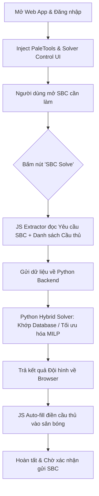

# Kỹ năng Giải SBC Tự Động (SBC Solver) cho FC26 Web App

> [!IMPORTANT]
> **QUY TẮC VẬN HÀNH:**
> - Kỹ năng này hoạt động song song hoặc tích hợp trực tiếp vào [fc_sbc_bot](../fc_sbc_bot).
> - Quá trình giải SBC được kích hoạt bằng nút **"SBC Solve"** trên giao diện Web App và tự động điền (Auto-fill) cầu thủ vào sân bóng.
> - Thuật toán tối ưu hóa (Solver) chạy trên Python backend sử dụng cơ sở dữ liệu công thức rating FUT.GG để khớp đội hình nhanh chóng, chính xác và bám sát thực tế nhất.

## 1. Các Tính Năng Chính
* **Tự Động Đọc Yêu Cầu SBC:** Tự động phân tích các điều kiện ràng buộc của SBC đang mở (Rating trung bình tối thiểu, số lượng cầu thủ Rare, số lượng cầu thủ TOTW/TOTS, v.v.).
* **Truy Xuất Cơ Sở Dữ Liệu Thời Gian Thực:** Quét toàn bộ cầu thủ khả dụng trong Club, SBC Storage (Duplicate pile) và hàng Unassigned.
* **Thuật Toán Hybrid Solver Thông Minh:**
  * **Phân tách SBC theo Rating & Lọc nghiêm ngặt:** SBC rating thấp (<87) ưu tiên khớp Database FUT.GG; SBC rating cao (>=87) bỏ qua Database và kích hoạt MILP Solver. Áp dụng luật lọc cứng: **Nếu SBC >= 89, cấm tuyệt đối thẻ dưới 84** (giảm rating bằng cách bớt thẻ cao thay vì dùng thẻ 80-83); nếu SBC <= 88, cấm tuyệt đối thẻ dưới 80.
  * **Đường cong chi phí ảo High-Low (Virtual Cost Curves):** Phân chia chi phí ảo động dựa trên vùng mong muốn: Thẻ cận trên (>= min_rating) và cận dưới (81-83 hoặc 84-86) có chi phí cực rẻ; thẻ cận trung có chi phí ảo cực đắt để bảo tồn phục vụ các SBC khác.
  * **Tối ưu hóa MILP Solver (Mixed-Integer Linear Programming):** Sử dụng các ràng buộc giới hạn trên nghiêm ngặt (Rating Upper Bound) cùng hàm chi phí ảo High-Low để tìm ra đội hình phối trộn cận trên và cận dưới tối ưu đạt vừa khít rating mục tiêu.
  * **Bảo vệ thẻ quan trọng (Blacklist):** Không tự ý sử dụng các cầu thủ trong đội hình chính (Active Squad), các thẻ Favorite hoặc danh sách Blacklist được cấu hình trước.
* **Auto-fill Tốc Độ Cao:** Tự động điền các cầu thủ đã tính toán vào đúng vị trí trên sân của Web App thông qua tương tác API JavaScript.

## 2. Cấu Trúc Thư Mục Kỹ Năng
Kỹ năng được phát triển trong thư mục [.agents/skills/fc_sbc_solve](./) phối hợp cùng:
* [Database/](Database): Chứa dữ liệu cầu thủ offline (ví dụ: [club-analyzer-2.csv](Database/club-analyzer-2.csv)) để thử nghiệm hoặc dự phòng.
* [.agents/rules/sbc_solve_rules.md](../../rules/sbc_solve_rules.md): Bộ nguyên tắc tối ưu hóa SBC (High-Low, bộ lọc cứng, bảo tồn cận trung) được Antigravity IDE tự động nạp.
* `src/`: Chứa mã nguồn triển khai chính:
  * `sbc_extractor.js` (Sắp phát triển): Script JS chạy trên trình duyệt để trích xuất dữ liệu SBC/cầu thủ và thực hiện điền đội hình.
  * `solver.py` (Sắp phát triển): Thuật toán giải tối ưu hóa tuyến tính bằng Python.
  * `solve_manager.py` (Sắp phát triển): Bộ điều khiển kết nối Playwright và Solver.

## 3. Cấu Hình Sử Dụng (`config.json`)
Bạn có thể cấu hình các tiêu chí giải SBC trong tệp [config.json](../fc_sbc_bot/config.json) của bot:
```json
{
  "sbc_solver": {
    "enabled": true,
    "min_rating_to_use": 82,
    "max_rating_to_use": 88,
    "prioritize_untradeable": true,
    "prioritize_sbc_storage": true,
    "protected_cards": {
      "active_squad": true,
      "favorites": true,
      "evolutions": true,
      "blacklist_ids": []
    }
  }
}
```

## 4. Quy Trình Hoạt Động (Workflow)

