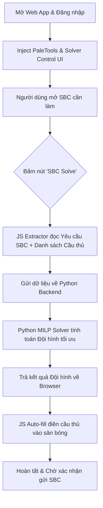

# Kỹ năng Giải SBC Tự Động (SBC Solver) cho FC26 Web App

> [!IMPORTANT]
> **QUY TẮC VẬN HÀNH:**
> - Kỹ năng này hoạt động song song hoặc tích hợp trực tiếp vào [fc_sbc_bot](file:///Users/binhnguyenthanh/Documents/FC%20Ultimate/.agents/skills/fc_sbc_bot).
> - Quá trình giải SBC được kích hoạt bằng nút **"SBC Solve"** trên giao diện Web App và tự động điền (Auto-fill) cầu thủ vào sân bóng.
> - Thuật toán tối ưu hóa (Solver) chạy trên Python backend sử dụng lập trình tuyến tính số nguyên (Mixed-Integer Linear Programming) để đảm bảo tốc độ tính toán nhanh nhất và chính xác nhất.

## 1. Các Tính Năng Chính
* **Tự Động Đọc Yêu Cầu SBC:** Tự động phân tích các điều kiện ràng buộc của SBC đang mở (Rating trung bình tối thiểu, số lượng cầu thủ Rare, số lượng cầu thủ TOTW/TOTS, v.v.).
* **Truy Xuất Cơ Sở Dữ Liệu Thời Gian Thực:** Quét toàn bộ cầu thủ khả dụng trong Club, SBC Storage (Duplicate pile) và hàng Unassigned.
* **Thuật Toán Tối Ưu Hóa (MILP Solver):**
  * **Đạt rating vừa đủ:** Tránh phí phạm cầu thủ rating cao (sử dụng đúng công thức tính rating SBC của EA).
  * **Tối ưu hóa chi phí (Best Price Cheap):** Tận dụng tối đa các thẻ duplicate trong SBC Storage và các thẻ rating thấp (từ 82 trở lên) trong Club.
  * **Bảo vệ thẻ quan trọng (Blacklist):** Không tự ý sử dụng các cầu thủ trong đội hình chính (Active Squad), các thẻ Favorite hoặc danh sách Blacklist được cấu hình trước.
* **Auto-fill Tốc Độ Cao:** Tự động điền các cầu thủ đã tính toán vào đúng vị trí trên sân của Web App thông qua tương tác API JavaScript.

## 2. Cấu Trúc Thư Mục Kỹ Năng
Kỹ năng được phát triển trong thư mục [.agents/skills/fc_sbc_solve](file:///Users/binhnguyenthanh/Documents/FC%20Ultimate/.agents/skills/fc_sbc_solve) với cấu trúc:
* [Database/](file:///Users/binhnguyenthanh/Documents/FC%20Ultimate/.agents/skills/fc_sbc_solve/Database): Chứa dữ liệu cầu thủ offline (ví dụ: [club-analyzer-2.csv](file:///Users/binhnguyenthanh/Documents/FC%20Ultimate/.agents/skills/fc_sbc_solve/Database/club-analyzer-2.csv)) để thử nghiệm hoặc dự phòng.
* `src/`: Chứa mã nguồn triển khai chính:
  * `sbc_extractor.js` (Sắp phát triển): Script JS chạy trên trình duyệt để trích xuất dữ liệu SBC/cầu thủ và thực hiện điền đội hình.
  * `solver.py` (Sắp phát triển): Thuật toán giải tối ưu hóa tuyến tính bằng Python.
  * `solve_manager.py` (Sắp phát triển): Bộ điều khiển kết nối Playwright và Solver.

## 3. Cấu Hình Sử Dụng (`config.json`)
Bạn có thể cấu hình các tiêu chí giải SBC trong tệp [config.json](file:///Users/binhnguyenthanh/Documents/FC%20Ultimate/.agents/skills/fc_sbc_bot/config.json) của bot:
```json
{
  "sbc_solver": {
    "enabled": true,
    "min_rating_to_use": 82,
    "max_rating_to_use": 88,
    "prioritize_untradeable": true,
    "prioritize_sbc_storage": true,
    "protected_cards": {
      "active_squad": true,
      "favorites": true,
      "evolutions": true,
      "blacklist_ids": []
    }
  }
}
```

## 4. Quy Trình Hoạt Động (Workflow)

