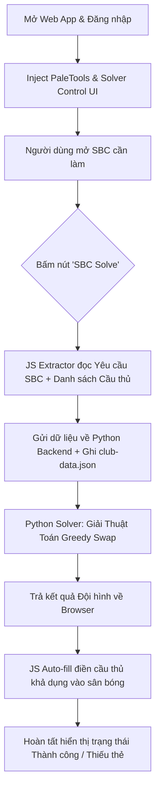

# Kỹ năng Giải SBC Tự Động (SBC Solver) cho FC26 Web App

> [!IMPORTANT]
> **QUY TẮC VẬN HÀNH:**
> - Kỹ năng này hoạt động song song hoặc tích hợp trực tiếp vào [fc_sbc_bot](../fc_sbc_bot).
> - Quá trình giải SBC được kích hoạt bằng nút **"SBC Solve"** trên giao diện Web App và tự động điền (Auto-fill) cầu thủ vào sân bóng.
> - Thuật toán giải quyết (Solver) dựa trên phương pháp tìm kiếm tham lam tuần tự (Greedy Swap) bắt đầu từ rating thấp nhất (min 82), chỉ dùng cầu thủ Untradeable và không dùng thẻ Evolution, ưu tiên giải phóng kho lưu trữ SBC Storage.

## 1. Các Tính Năng Chính
* **Tự Động Đọc Yêu Cầu SBC:** Tự động phân tích các điều kiện ràng buộc của SBC đang mở (Rating trung bình tối thiểu, số lượng cầu thủ yêu cầu).
* **Truy Xuất Cơ Sở Dữ Liệu Thời Gian Thực:** Quét toàn bộ cầu thủ khả dụng trong Club, SBC Storage (Duplicate pile) và hàng Unassigned.
* **Thuật Toán Greedy Swap Solver Tối Ưu:**
  * **Khởi tạo thông minh:** Lấy ra sbc_size cầu thủ có rating thấp nhất (rating >= 82) làm đội hình xuất phát ban đầu.
  * **Tăng dần rating tuần tự:** Lần lượt duyệt qua từng vị trí để thay thế bằng cầu thủ có rating cao hơn trong pool dự phòng, giới hạn tối đa bởi rating cao nhất của thẻ trong SBC Storage khả dụng.
  * **Dừng sớm tối ưu:** Dừng ngay lập tức khi rating đội hình đạt yêu cầu (chấp nhận thấp hơn yêu cầu tối đa 0.5 rating).
  * **Ràng buộc chặt chẽ:** Chỉ chọn cầu thủ untradeable = true và evolution = false. Ưu tiên chọn cầu thủ sbc_storage = true.
  * **Bảo vệ thẻ quan trọng (Blacklist):** Không tự ý sử dụng các cầu thủ trong đội hình chính (Active Squad), các thẻ Favorite hoặc danh sách Blacklist được cấu hình trước.
* **Lưu Trữ Dữ Liệu Debug:** Tự động lưu trữ dữ liệu cầu thủ đã load từ Web App vào tệp tin `Database/club-data.json` theo đúng cấu trúc của `debug_run.json`.
* **Auto-fill Tốc Độ Cao:** Tự động điền các cầu thủ đã tính toán vào đúng vị trí trên sân của Web App thông qua tương tác API JavaScript.

## 2. Cấu Trúc Thư Mục Kỹ Năng
Kỹ năng được phát triển trong thư mục [.agents/skills/fc_sbc_solve](./) phối hợp cùng:
* [Database/club-data.json](Database/club-data.json): Dữ liệu cầu thủ lưu từ Web App phục vụ mục đích debug.
* [.agents/rules/sbc_solve_rules.md](../../rules/sbc_solve_rules.md): Bộ nguyên tắc tối ưu hóa SBC được Antigravity IDE tự động nạp.
* `src/`: Chứa mã nguồn triển khai chính:
  * `sbc_extractor.js`: Script JS chạy trên trình duyệt để trích xuất dữ liệu SBC/cầu thủ và thực hiện điền đội hình.
  * `solver.py`: Thuật toán giải tối ưu hóa dựa trên greedy swap bằng Python.
  * `solve_manager.py`: Bộ điều khiển kết nối Playwright và Solver, xử lý logic hiển thị và giao tiếp.

## 3. Cấu Hình Sử Dụng (`config.json`)
Bạn có thể cấu hình các tiêu chí giải SBC trong tệp [config.json](../fc_sbc_bot/config.json) của bot:
```json
{
  "sbc_solver": {
    "enabled": true,
    "min_rating_to_use": 80,
    "max_rating_to_use": 89,
    "prioritize_untradeable": true,
    "prioritize_sbc_storage": true,
    "protected_cards": {
      "active_squad": true,
      "favorites": true,
      "evolutions": true,
      "blacklist_ids": []
    }
  }
}
```

## 4. Quy Trình Hoạt Động (Workflow)

